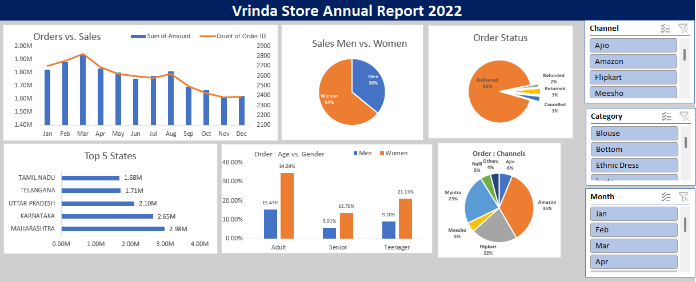

# 🏪 Vrinda Store Data Analysis Project

## Project Description

The goal of this project is to create a dashboard of annual sales data for a fictitious store called Vrinda Store for the year 2024. This dashboard aims to provide a visually appealing and intuitive interface to easily interpret key metrics and get new insights about the business in order to make data-driven decisions for improving sales for 2023.

**Disclaimer:** All datasets and reports are fictional and used solely for demonstration purposes to showcase Excel capabilities.

## Tech Stack Used

- Excel

## Skills Showcased in this Project

- Data Cleaning, Data Transformation, Data Analysis
- Filtering, Sorting, and Conditional functions
- Pivot Tables and Pivot Charts
- Dashboard creation

## Business Questions Explored

This project delves into various business questions to uncover insights that drive growth:

- **Comparative Sales and Orders Analysis:** Visualizing the connection between sales and orders.
- **Highest Sales Month:** Identifying the month with the highest sales.
- **Gender-Based Analysis:** Analyzing purchasing patterns between men and women.
- **Order Status Breakdown:** Detailed analysis of order statuses throughout the year.
- **Top Sales Contributing States:** Highlighting states contributing significantly to sales.
- **Age and Gender Relation:** Understanding the relationship between age, gender, and orders.
- **Channel Contribution to Sales:** Assessing the impact of sales channels on revenue.
- **Highest Selling Category:** Identifying the top-selling category.

## Data Sourcing

The dataset was provided by Rishabh Mishra. Grateful for his guidance throughout this project.

## Data Cleaning and Transformation

- Checked for NULL values, blanks, and errors.
- Removed duplicates and irrelevant columns.
- Ensured data consistency with respect to data type, format, and values.
- Created new attributes 'Age Group' and 'Month' for easier interpretation.

## Data Analysis

- Created six pivot tables to summarize data and identify trends.
- Analyzed relationships between sales and factors such as gender, orders by month, top states, order statuses, channels, and age groups.

## Data Visualization

- Created a dashboard using pivot charts customized for each pivot table.
- Implemented 3 "Slicers" for user-friendly and interactive filtering.

## Final Dashboard Snippet

## Insights

Key insights from the analysis include:

- **Peak Months:** February and March witness the highest orders and sales activity.
- **Gender Trends:** Women account for approximately 64% of total purchases.
- **Top States:** Maharashtra, Karnataka, and Uttar Pradesh contribute around 35% of sales.
- **Age Matters:** The adult age group (31-50 yrs) contributes significantly (~50%) to sales.
- **Dominant Channels:** Amazon, Flipkart, and Myntra dominate, contributing to ~80% of sales.
- **Order Status Breakdown:** 92% of orders are marked as "delivered," reflecting effective fulfillment processes.
